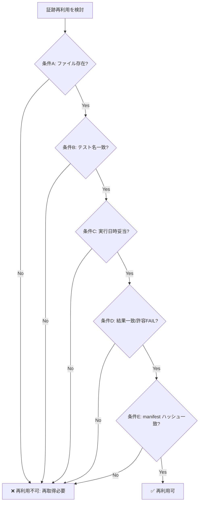

# 証跡再利用ルール (Evidence Reuse Rules)

**バージョン**: 1.0.0
**作成日**: 2026-02-20
**対象タスク**: TASK_055_EvidenceReuseAutomation
**参照先**: TASK_053_MVPFinalVerificationPack (利用者)

---

## 目的

連続ゲート作業（TASK_047 → TASK_053 等）において、既存の証跡（テスト結果・ログ・ビルド成果物）を安全に再利用するための判定基準を提供する。証跡の回収コストを下げつつ、品質保証の正確性を担保する。

---

## 基本原則

> 「ファイルが存在する」だけでは再利用を認めない。以下の全条件が揃った場合にのみ再利用可とする。

---

## 必須判定条件（すべて満たすこと）

### 条件 A: ファイル存在確認

| 確認項目 | チェック方法 |
|---|---|
| 対象証跡ファイルがパス通りに存在する | `Get-ChildItem <path>` または `ls` |
| ファイルサイズが 0 bytes でない | ファイルサイズ > 0 を確認 |

### 条件 B: テスト名の一致

| 確認項目 | チェック方法 |
|---|---|
| XML/ログに記録されたテスト名が現在のタスクで要求するテスト名と完全一致する | 証跡内の `fullname` / `name` 属性と DoD のテスト名を照合 |
| テスト名リストに欠落がない（DoD で要求されるすべてのテストが記録されている） | DoD テスト一覧 vs 証跡内テスト一覧の差分を確認 |

### 条件 C: 実行日時の妥当性

| 確認項目 | チェック方法 |
|---|---|
| 証跡の実行日時が対象ゲートの **前提タスク完了日時以降** である | `start-time` / `end-time` 属性と前提タスクのコミット日時を比較 |
| 有効期限ウィンドウ内（既定: 前提タスク完了から **30日以内**）である | 現在日時 − 実行日時 ≤ 30日 |
| 前提タスクの修正コミット後に実施されているか（修正前の証跡は無効） | 証跡日時 > 前提タスクの最終コミット日時 |

### 条件 D: 結果の一致（正当性確認）

| 確認項目 | チェック方法 |
|---|---|
| 再利用する証跡の結果が現ゲートの合格基準（PASS / 既知の許容 FAIL）を満たす | 各テストケースの `result` 属性を DoD の合格基準と照合 |
| FAIL がある場合は「既知の残課題」として文書化されていること | 対応タスクのレポート / チケットに FAIL 理由が記載済みであること |

### 条件 E: 証跡ハッシュ / manifest 整合性

| 確認項目 | チェック方法 |
|---|---|
| `evidence_manifest.json`（後述）が存在し、証跡ファイルのハッシュが一致する | manifest の `sha256` フィールドと実ファイルのハッシュを比較 |
| manifest の `source_task` が証跡を生成したタスクと一致する | `source_task` フィールドを確認 |

---

## 再利用判定フロー



---

## evidence_manifest.json フォーマット

各 `docs/evidence/<TASK_XXX>/` ディレクトリに以下の形式の `evidence_manifest.json` を配置する。

```json
{
  "schema_version": "1.0",
  "source_task": "TASK_047",
  "generated_at": "2026-02-20T15:59:00+09:00",
  "generated_by": "TASK_055_EvidenceReuseAutomation",
  "files": [
    {
      "path": "PlayModeResults.xml",
      "sha256": "<SHA256_HASH>",
      "size_bytes": 5922,
      "recorded_at": "2026-02-17T08:36:54Z",
      "test_suite": "VerticalSliceSmokeGatePlayModeTests",
      "tests": [
        {
          "fullname": "ProjectFoundPhone.Tests.VerticalSliceSmokeGatePlayModeTests.DebugChatScene_ChoiceAndImageFallback_AreUsable",
          "result": "Passed"
        },
        {
          "fullname": "ProjectFoundPhone.Tests.VerticalSliceSmokeGatePlayModeTests.VerticalSlice_SmokeFlow_TitleToChat_SaveLoad",
          "result": "Failed",
          "known_issue": "TitleScene: TitleScreenManager not found (既知残課題, TASK_052 記録済み)"
        }
      ]
    }
  ]
}
```

---

## 再利用可能 / 不可の分類例（TASK_047 証跡 → TASK_053 適用時）

| 証跡 | 再利用可否 | 理由 |
|---|---|---|
| `PlayModeResults.xml` (2026-02-17) | ✅ **条件付き再利用可** | テスト名一致, 30日以内, PASS 1件/FAIL 1件(既知). TASK_053 で「再取得不要」と判定 |
| `Build_052c.log` (2026-02-17) | ✅ **再利用可** | ビルド成功ログ, 日時条件OK |
| `TinyChatNovel.exe` (TASK_049) | ✅ **再利用可** | ビルド成果物, 前提タスク完了後, サイズ確認済み |
| スクリーンショット群 (2026-02-17) | ⚠️ **シーン変更時は再取得** | UI・シーン変更がある場合は古い SS は無効 |

---

## TASK_053 への適用ガイダンス

TASK_053 着手前に以下を実施すること:

1. `docs/evidence/TASK_047/evidence_manifest.json` の全ファイルに対して上記5条件を確認する。
2. 条件を満たす証跡は「再利用可」としてリストアップし、TASK_053 チェックリストに記載する。
3. 条件を満たさない証跡は「再取得必要」としてリストアップし、取得タスクをバックログに追加する。
4. FAIL が残っている証跡は「既知の残課題」として TASK_053 レポートに明記し、合格基準に影響しないことを確認する。

---

## 運用手順（manifest 生成）

manifest はタスク専用 Worker が手動または PowerShell スクリプトで生成する。  
スクリプトが存在しない場合は以下の手順に従う:

```powershell
# 例: TASK_047 証跡の SHA256 取得
Get-FileHash docs\evidence\TASK_047\PlayModeResults.xml -Algorithm SHA256 | Select-Object Hash, Path
Get-Item docs\evidence\TASK_047\PlayModeResults.xml | Select-Object Name, Length, LastWriteTimeUtc
```

取得した値を `evidence_manifest.json` の `sha256` / `size_bytes` / `recorded_at` に記入する。

---

## 改訂履歴

| バージョン | 日付 | 変更内容 |
|---|---|---|
| 1.0.0 | 2026-02-20 | 初版作成（TASK_055） |
