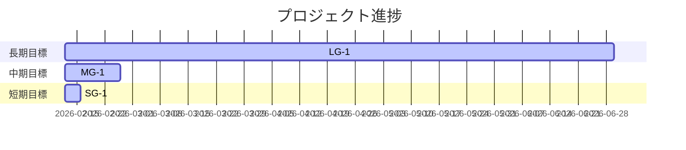

# Milestone Plan

## 基本情報

- **最終更新**: 2026-02-12T14:00:00+09:00
- **更新者**: AI Agent

---

## 長期目標（Someday / 月次〜四半期）

### LG-1: プロダクション準備とリリース基盤

- **ゴール**: メインストーリー制作と配信基盤（Addressables/CI/CD/QA）を整え、リリース準備に入れること
- **期限目安**: 2026-06
- **状態**: 未着手
- **進捗**: 0%
- **関連マイルストーン**: MG-1, MG-2

---

## 中期目標（Later / 1〜2週間）

### MG-1: MVP安定化と最低限の品質基盤

- **ゴール**: MVP完走の検証完了と、性能・通しテストの最小基準を満たす
- **期限目安**: 2026-02-26
- **状態**: 進行中
- **進捗**: 40%
- **含まれるタスク**: TASK_MVP_04, TASK_025, TASK_027
- **完了基準**:
  - [ ] MVPの通し完走（60秒以内）の記録
  - [ ] Console Error/Exception 0
  - [ ] TASK_025 After計測の完了
  - [ ] TASK_027 手動フルプレイの完了
  - [ ] テスト全通過・ビルド成功

---

## 短期目標（Next / 今日〜数日）

### SG-1: MVP縦切りの最終確認

- **ゴール**: MVPチェックリストの確認を完了し、次フェーズへ移行する
- **対象タスク**: TASK_MVP_04
- **完了基準**:
  - [ ] Title→Play→Choice→Endの完走を確認
  - [ ] 連打時の進行破綻がないことを確認
  - [ ] Console Error/Exception 0

---

## 現在地マップ

---

## 振り返りログ（KPT）

### 2026-02-12: MVP安定化の確認（短期チェックポイント）

**Keep（続けること）**:

- MVP最短導線の維持と連打耐性の重視

**Problem（課題）**:

- フォント表示問題で進行確認が遅延

**Try（次に試すこと）**:

- MVP検証をタスク化し、証跡と完了条件を明文化

**優先度変更**:

- TASK_MVP_04 を最優先へ繰り上げ

---

## 履歴

- 2026-02-12 14:00: MILESTONE_PLAN.md を初期化
