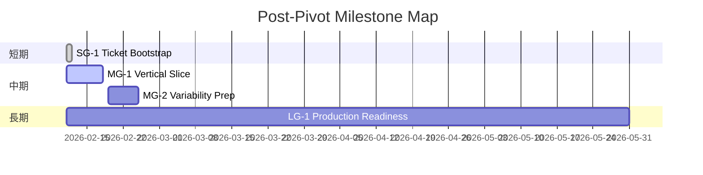

# Milestone Plan

## 基本情報

- **最終更新**: 2026-02-11T00:00:00+09:00
- **更新者**: Orchestrator

---

## 長期目標（Someday / 月次-四半期）

### LG-1: Chat Novel Engine Production Readiness

- **ゴール**: テーマ分離可能なチャットノベルエンジンとして、複数ストーリーを安全に運用できる状態に到達する。
- **期限目安**: 2026-05
- **状態**: 進行中
- **進捗**: 20%
- **関連マイルストーン**: MG-1, MG-2

---

## 中期目標（Later / 1-2週間）

### MG-1: Vertical Slice Completion

- **ゴール**: タイトルからチャット進行、分岐、待機、セーブ/ロードまでを1本のシナリオで通し動作させる。
- **期限目安**: 2026-02-18
- **状態**: 進行中
- **進捗**: 35%
- **含まれるタスク**: TASK_045, TASK_046, TASK_047
- **完了基準**:
  - [ ] Vertical Slice対象範囲が固定されている
  - [ ] `ChatDialogueView` の正式導線で通しプレイ可能
  - [ ] スモーク検証（自動+手動）で破綻検知可能
  - [ ] テスト全通過・ビルド成功

### MG-2: Engine Variability Prep

- **ゴール**: FoundPhone/Meta Horror のテーマ差し替えを想定した構成ガイドを整備する。
- **期限目安**: 2026-02-25
- **状態**: 未着手
- **進捗**: 0%
- **含まれるタスク**: TBD（Phase 3完了後に起票）
- **完了基準**:
  - [ ] テーマ依存演出の分離指針が文書化
  - [ ] シナリオテンプレート運用が定義済み
  - [ ] テスト不要項目には理由が明記されている

---

## 短期目標（Next / 今日-数日）

### SG-1: Phase 0-2 Ticket Bootstrap

- **ゴール**: Vertical Slice開始に必要な初期3タスクを起票し、Workerへ委譲可能状態にする。
- **対象タスク**: TASK_045, TASK_046, TASK_047
- **完了基準**:
  - [x] タスク起票（Status: OPEN）
  - [x] DoD 定義
  - [x] Test Plan 記載
  - [x] Milestone 紐付け

---

## 現在地マップ

---

## 振り返りログ（KPT）

### 2026-02-11: Pivot Alignment KPT（5タスク以上完了後の再整列）

**Keep（続けること）**:

- 仕様のSSOTを明確化してから実装優先度を決める運用
- 変更方針を `AI_CONTEXT.md` とロードマップへ即時同期する運用

**Problem（課題）**:

- 旧タスク群と新方針の整合が弱く、優先順位が読み取りづらい
- テスト網羅先行の慣性で、縦切り導線の可視化が遅れた

**Try（次に試すこと）**:

- 縦切り導線に紐づくタスクのみを先行起票し、Phase単位でWorker委譲する
- スモーク検証を先に整備し、回帰検知のサイクルを短縮する

**優先度変更**:

- 「全面テスト拡充」を短期主目標から外し、「縦切り実装 + スモーク検証」を最優先へ変更

---

## 履歴

- 2026-02-11 00:00: MILESTONE_PLAN.md を初期運用化（テンプレートから実運用へ置換）
