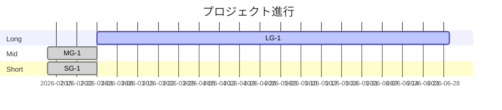

# Milestone Plan

## 基本情報

- 最終更新: 2026-03-01T16:06:00+09:00
- 更新者: Codex Orchestrator

---

## 長期マイルストーン

### LG-1: Production readiness

- 目的: Addressables / CI / QA を含むリリース準備へ移行する
- 期限目安: 2026-06
- 現状: 未着手
- 進捗: 10%
- 関連: MG-1 完了後の次サイクル設計

---

## 中期マイルストーン

### MG-1: MVP 検証と最小品質の収束

- 目的: MVP の主要検証を完了し、次段階へ進める状態を作る
- 期限目安: 2026-03-05
- 現状: 完了
- 進捗: 100%
- 関連タスク: TASK_047, TASK_049, TASK_052, TASK_MVP_04, TASK_027, TASK_053, TASK_025, TASK_054, TASK_055
- 完了条件:
  - [x] MVP 主要導線の検証
  - [x] Console Error / Exception 0
  - [x] TASK_047 完了
  - [x] TASK_049 完了
  - [x] TASK_052 完了
  - [x] TASK_027 完了
  - [x] TASK_053 完了
  - [x] TASK_025 after measurement と verdict 更新
  - [x] `DebugChatScene` の `missing script` source attribution and prefab cleanup
  - [x] verification automation hardening の task/report 化

---

## 短期マイルストーン

### SG-1: MVP 検証パック完了

- 目的: MVP チェックリストの最小完了条件を満たす
- 期限目安: 2026-03-02
- 現状: 完了
- 進捗: 100%
- 対応タスク: TASK_MVP_04, TASK_027, TASK_053

---

## 現在地マップ

```mermaid
gantt
    title プロジェクト進行
    dateFormat  YYYY-MM-DD
    section Long
    LG-1 :active, lg1, 2026-03-01, 2026-06-30
    section Mid
    MG-1 :done, mg1, 2026-02-12, 2026-03-01
    section Short
    SG-1 :done, sg1, 2026-02-12, 2026-03-01
```

---

## Keep / Problem / Try

### 2026-03-01

**Keep**

- MVP / Vertical Slice / Performance の batch automation を最新 evidence で維持できた
- stale legacy task docs を現行実装と証跡へ接続し、次回の探索コストを下げた
- workflow script 側の validator / checker / todo sync の可読性を改善した

**Problem**

- unrelated local modifications と transient artifacts が worktree に残る
- `docs/logs/unity_automation_task027_20260301.log` が別プロセスに掴まれている
- `.shared-workflows` の改善は submodule commit と root pointer 更新を揃えて完了させる必要がある

**Try**

- Phase 1 sync へ入り、LG-1 の最初の slice を Addressables / CI / QA から 1 本に絞る
- user-side local modifications と generated artifact の扱いを分離したまま次サイクルへ移行する

---

## 履歴

- 2026-03-01 16:06: orchestrator-owned boundary を `63619cf` で固定し、next-cycle Phase 1 sync ready へ遷移
- 2026-03-01 16:01: stale legacy task/report docs を整流化し、workflow diagnostics (`session-end-check` / `report-validator` / `todo-sync`) を改善
- 2026-03-01 05:37: `TASK_054` / `TASK_055` を追加し、verification hardening と hygiene normalization を文脈へ固定
- 2026-03-01 05:20: `MessageBubble.prefab` の missing MonoBehaviour を cleanup、subsequent batch run で warning 消失を確認
- 2026-03-01 04:00: `TASK_025` batch after measurement を再実行、`GC Alloc 22 -> 8 KB/frame` / verdict `IMPROVED` を更新
- 2026-03-01 02:05: `TASK_MVP_04` / `TASK_027` / `TASK_053` を batch evidence でクローズ
- 2026-02-28 21:36: root repo / `.shared-workflows` の remote 状態と現状整流を確認
