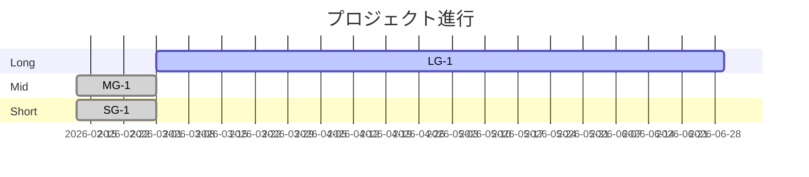

# Milestone Plan

## 基本情報

- 最終更新: 2026-03-01T05:37:17+09:00
- 更新者: Codex Orchestrator

---

## 長期マイルストーン

### LG-1: Production readiness

- 目標: Addressables / CI / QA を含むリリース準備へ移行する
- 期限目安: 2026-06
- 状態: 未着手
- 進捗: 10%
- 関連: MG-1 完了後の次サイクル計画

---

## 中期マイルストーン

### MG-1: MVP 検証と最低限の品質基盤

- 目標: MVP の主要検証を通し、最低限の品質基盤を閉じる
- 期限目安: 2026-03-05
- 状態: 完了
- 進捗: 100%
- 関連タスク: TASK_047, TASK_049, TASK_052, TASK_MVP_04, TASK_027, TASK_053, TASK_025, TASK_054, TASK_055
- 完了条件:
  - [x] MVP 主要導線の検証
  - [x] Console Error/Exception 0
  - [x] TASK_047 完了
  - [x] TASK_049 完了
  - [x] TASK_052 完了
  - [x] TASK_027 完了
  - [x] TASK_053 完了
  - [x] TASK_025 after measurement と verdict 更新
  - [x] `DebugChatScene` の `missing script` source attribution and prefab cleanup
  - [x] verification automation hardening の文脈を task/report に固定

---

## 短期マイルストーン

### SG-1: MVP 検証パック完了

- 目標: MVP チェックリストの最低限完了条件を閉じる
- 期限目安: 2026-03-02
- 状態: 完了
- 進捗: 100%
- 対象タスク: TASK_MVP_04, TASK_027, TASK_053

---

## 現在地マップ

```mermaid
gantt
    title プロジェクト進行
    dateFormat  YYYY-MM-DD
    section Long
    LG-1 :active, lg1, 2026-03-01, 2026-06-30
    section Mid
    MG-1 :done, mg1, 2026-02-12, 2026-03-01
    section Short
    SG-1 :done, sg1, 2026-02-12, 2026-03-01
```

---

## Keep / Problem / Try

### 2026-03-01

**Keep**

- MVP / Vertical Slice / Performance の batch automation を再実行して最新 evidence を生成できた
- `MessageBubble.prefab` の欠損 MonoBehaviour を cleanup し、raw `missing script` warning を解消できた
- 自動化 hardening を `TASK_054` として retrospective task 化し、プロジェクト内文脈を保持できた

**Problem**

- unrelated local modifications と transient artifacts が同じ worktree に残る
- `docs/logs/unity_automation_task027_20260301.log` が別プロセスに掴まれている

**Try**

- orchestrator-owned boundary を commit で確定する
- その後に `TASK_044` / `TASK_046` の再優先付けへ移る

---

## 履歴

- 2026-03-01 05:37: `TASK_054` / `TASK_055` を追加し、verification hardening と hygiene normalization を台帳へ反映
- 2026-03-01 05:20: `MessageBubble.prefab` の missing MonoBehaviour を cleanup し、subsequent batch run で `missing script` warning 消失を確認
- 2026-03-01 04:00: `TASK_025` batch after measurement を再実行し、`GC Alloc 22 -> 8 KB/frame` / verdict `IMPROVED` を更新
- 2026-03-01 02:05: `TASK_MVP_04` / `TASK_027` / `TASK_053` を batch evidence でクローズ
- 2026-02-28 21:36: root repo / `.shared-workflows` の remote 整合と状態整流化を実施
