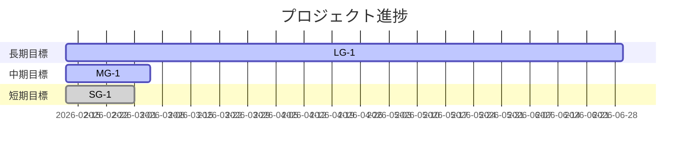

# Milestone Plan

## 基本情報

- **最終更新**: 2026-03-01T02:05:15+09:00
- **更新者**: Codex Orchestrator

---

## 長期目標（Someday / 月次〜四半期）

### LG-1: プロダクション準備とリリース基盤

- **ゴール**: メインストーリー制作と配信基盤（Addressables/CI/CD/QA）を整え、リリース準備に入れること
- **期限目安**: 2026-06
- **状態**: 未着手
- **進捗**: 10%
- **関連マイルストーン**: MG-1, MG-2

---

## 中期目標（Later / 1〜2週間）

### MG-1: MVP安定化と最低限の品質基盤

- **ゴール**: MVP完走の検証完了と、性能・通しテストの最小基準を満たす
- **期限目安**: 2026-03-05
- **状態**: 進行中
- **進捗**: 90%
- **含まれるタスク**: TASK_047, TASK_049, TASK_052, TASK_053, TASK_MVP_04, TASK_025, TASK_027
- **完了基準**:
  - [x] MVPの通し完走（60秒以内）の記録
  - [x] Console Error/Exception 0
  - [x] TASK_047 の PlayMode/Build 証跡回収完了
  - [x] TASK_049 の Build Gate 修正完了
  - [x] TASK_025 After計測と verdict 記録の完了
  - [x] TASK_027 フルプレイ証跡の完了
  - [x] テスト全通過・ビルド成功
  - [ ] TASK_025 の source attribution と次の改善施策の切り出し

---

## 短期目標（Next / 今日〜数日）

### SG-1: MVP縦切りの最終確認

- **ゴール**: MVPチェックリストの確認を完了し、次フェーズへ移行する
- **期限目安**: 2026-03-02
- **状態**: 完了
- **進捗**: 100%
- **対象タスク**: TASK_MVP_04, TASK_027, TASK_053
- **完了基準**:
  - [x] Title→Play→Choice→Endの完走を確認
  - [x] 連打時の進行破綻がないことを確認
  - [x] Console Error/Exception 0

---

## 現在地マップ

```mermaid
gantt
    title プロジェクト進捗
    dateFormat  YYYY-MM-DD
    section 長期目標
    LG-1            :active, lg1, 2026-02-12, 2026-06-30
    section 中期目標
    MG-1            :active, mg1, 2026-02-12, 2026-03-05
    section 短期目標
    SG-1            :done, sg1, 2026-02-12, 2026-03-01
```

---

## 振り返りログ（KPT）

### 2026-03-01: 自動検証導線で短期ゲートをクローズ

**Keep（続けること）**:

- 実装と証跡取得を同じ automation 導線にまとめる

**Problem（課題）**:

- batch capture の raw log に `ReadPixels...` ノイズと `missing script` 行が残る
- `TASK_025` は verdict を固定できたが、改善そのものは未達

**Try（次に試すこと）**:

- `TASK_025` の alloc source attribution を Layer A として着手する
- verification automation の証跡品質を一段硬化する

**優先度変更**:

- SG-1 は完了。次の最優先は `TASK_025` へ移行

---

## 履歴

- 2026-03-01 02:05: `TASK_MVP_04` / `TASK_027` / `TASK_053` を自動検証でクローズし、`TASK_025` verdict を `NO_MEASURABLE_REDUCTION` に固定
- 2026-02-28 21:36: リモート同期を再確認（root / `.shared-workflows` ともに behind 0）。TASK_047/TASK_052 完了を反映し、残件を `TASK_027/TASK_053` の最小手動ブロックへ集約
- 2026-02-26 22:45: DebugChatScene 実行証跡を反映（TASK_027/053は継続、TASK_025は部分計測）
- 2026-02-22 06:10: Phase 6 再計画に合わせて MG-1 の対象タスクと進捗を更新
- 2026-02-22 16:10: TASK_049 完了証跡（Build2.log / TinyChatNovel.exe）を反映
- 2026-02-12 14:00: MILESTONE_PLAN.md を初期化
