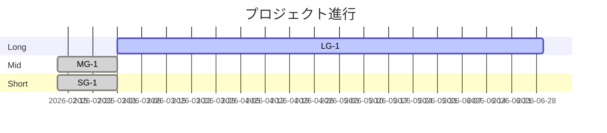

# Milestone Plan

## 基本情報

- 最終更新: 2026-03-01T16:21:46+09:00
- 更新者: Codex Orchestrator

---

## 長期マイルストーン

### LG-1: Production readiness

- 目的: Addressables / CI / QA を含むリリース準備へ移行する
- 期限目安: 2026-06
- 現状: 着手済み
- 進捗: 20%
- 関連:
  - `TASK_056_CIReadinessBaseline` (current)
  - next candidate: QA slice
  - later candidate: Addressables migration planning

---

## 中期マイルストーン

### MG-1: MVP 検証と最小品質の収束

- 目的: MVP の主要検証を完了し、次段階へ進める状態を作る
- 期限目安: 2026-03-05
- 現状: 完了
- 進捗: 100%
- 関連タスク: TASK_047, TASK_049, TASK_052, TASK_MVP_04, TASK_027, TASK_053, TASK_025, TASK_054, TASK_055

---

## 短期マイルストーン

### SG-1: MVP 検証パック完了

- 目的: MVP チェックリストの最小完了条件を満たす
- 期限目安: 2026-03-02
- 現状: 完了
- 進捗: 100%
- 対応タスク: TASK_MVP_04, TASK_027, TASK_053

---

## 現在地マップ

```mermaid
gantt
    title プロジェクト進行
    dateFormat  YYYY-MM-DD
    section Long
    LG-1 :active, lg1, 2026-03-01, 2026-06-30
    section Mid
    MG-1 :done, mg1, 2026-02-12, 2026-03-01
    section Short
    SG-1 :done, sg1, 2026-02-12, 2026-03-01
```

---

## Keep / Problem / Try

### 2026-03-01

**Keep**

- MVP / Vertical Slice / Performance の batch automation が安定している
- stale legacy task docs を現行実装と証跡へ接続できた
- CI baseline を先に切ることで、以後の LG-1 作業に remote guard を入れられる

**Problem**

- user-side local modifications と generated artifact が worktree に残る
- `TASK_056` は remote run を見ない限り Layer B が閉じない
- Addressables は依然として面積が大きい

**Try**

- `TASK_056` Layer B は pending のまま固定し、次の LG-1 slice 候補を QA に寄せて監査する
- CI baseline を起点に次タスクの remote guard 前提を整える

---

## 履歴

- 2026-03-01 16:21: LG-1 entry slice として `TASK_056_CIReadinessBaseline` を起票し、GitHub Actions baseline を追加
- 2026-03-01 16:06: orchestrator-owned boundary を `63619cf` / `fcda472` で固定し、next-cycle sync ready へ遷移
- 2026-03-01 05:37: `TASK_054` / `TASK_055` を追加し、verification hardening と hygiene normalization を文脈へ固定
