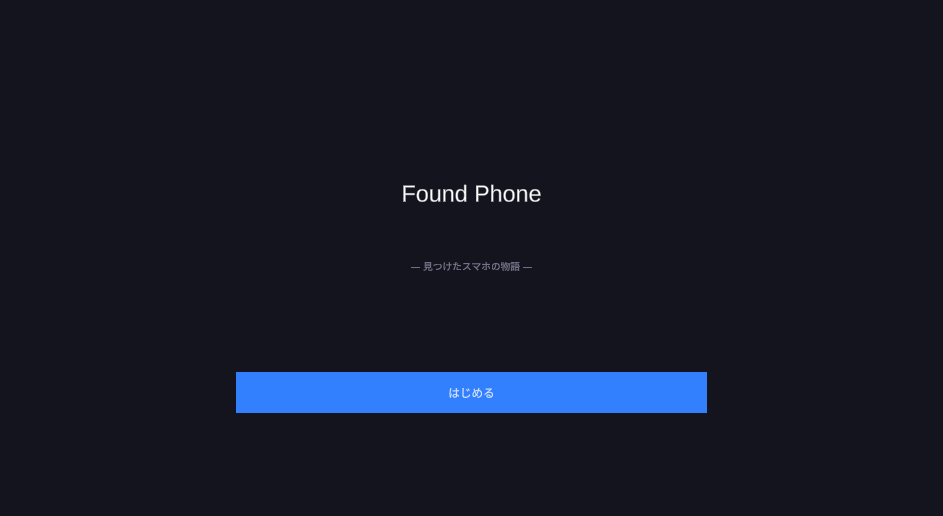
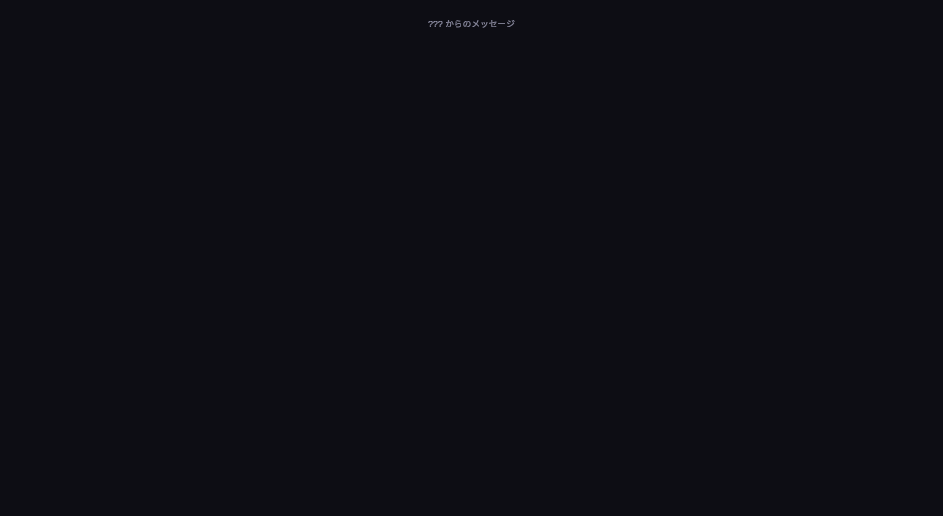
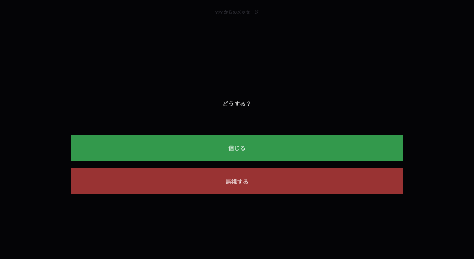
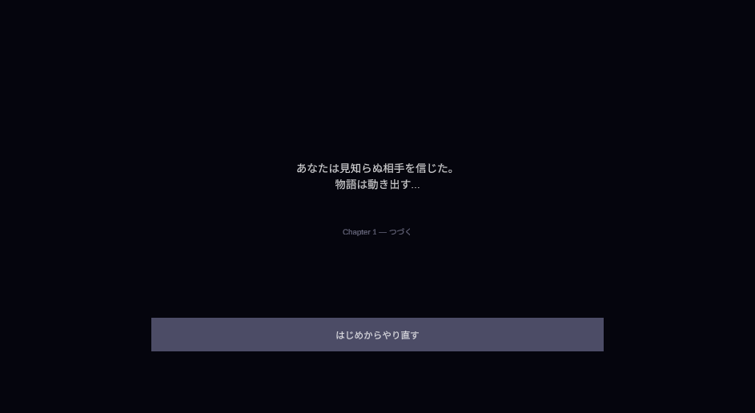

# Visual Progress Index

進捗を即確認するための画面証跡索引です。非 archive の現行配置では、スクリーンショットは `Assets/Screenshots/` にまとまっています。

## 使い方

- MkDocs では `tools/generate-doc-nav.ps1 -PrepareView` が `Assets/Screenshots/` を閲覧用コピーへ含めます。
- 画面翻訳確認の対象は本文 docs であり、スクリーンショットは見た目の補助証跡として扱います。
- 画像名は旧 MVP / Real / Final 系が混在しているため、最新 SP-023 / SP-024 検収済みとは断定しません。

## すぐ見る 4 枚

| 画面 | 画像 | 配置 |
|---|---|---|
| Title |  | `Assets/Screenshots/Title_State_Real.png` |
| Chat |  | `Assets/Screenshots/Chat_State_Real.png` |
| Choice |  | `Assets/Screenshots/Choice_State_Final.png` |
| End |  | `Assets/Screenshots/End_State_Final.png` |

## スクリーンショット一覧

| ファイル | 推定される確認対象 | サイズ | 鮮度メモ |
|---|---|---|---|
| `Assets/Screenshots/01_Title_State.png` | Title 状態 | 943x516 | MVP 期の画面証跡 |
| `Assets/Screenshots/Title_Screen_MVP.png` | Title MVP | 943x516 | MVP 期の画面証跡 |
| `Assets/Screenshots/Title_State_Real.png` | Title 実画面系 | 943x516 | MVP 期の画面証跡 |
| `Assets/Screenshots/MVP_01_Title.png` | Title MVP | 943x516 | MVP 期の画面証跡 |
| `Assets/Screenshots/MVP_01_Title-1.png` | Title MVP | 943x516 | MVP 期の画面証跡 |
| `Assets/Screenshots/02_Chat_Screen_MVP.png` | Chat MVP | 943x516 | MVP 期の画面証跡 |
| `Assets/Screenshots/02_Chat_State_AfterManual.png` | Chat 手動確認後 | 943x516 | MVP 期の画面証跡 |
| `Assets/Screenshots/Chat_State_Real.png` | Chat 実画面系 | 943x516 | MVP 期の画面証跡 |
| `Assets/Screenshots/MVP_02_Chat.png` | Chat MVP | 943x516 | MVP 期の画面証跡 |
| `Assets/Screenshots/MVP_Current_State.png` | MVP 現状 | 943x516 | MVP 期の画面証跡 |
| `Assets/Screenshots/03_Choice_Screen_MVP.png` | Choice MVP | 943x516 | MVP 期の画面証跡 |
| `Assets/Screenshots/Choice_State_Final.png` | Choice final 系 | 943x516 | MVP 期の画面証跡 |
| `Assets/Screenshots/04_End_Screen_MVP.png` | End MVP | 943x516 | MVP 期の画面証跡 |
| `Assets/Screenshots/End_State_Final.png` | End final 系 | 943x516 | MVP 期の画面証跡 |

## 次に追加すると見通しが良くなる画像

| Turn | 撮る対象 | 推奨ファイル名 | 減る摩擦 |
|---|---|---|---|
| Turn 1 | `SP023_NarrationMargin_Start` | `Assets/Screenshots/T01_SP023_NarrationMargin.png` | テキスト表現の見た目を即確認できる |
| Turn 1 | `SP023_LocalExtensions_Start` | `Assets/Screenshots/T01_SP023_LocalExtensions.png` | `IconSide` / `SetThreadMeta` の見た目確認が残る |
| Turn 1 | `SP023_DisplayShowcase_Start` | `Assets/Screenshots/T01_SP023_DisplayShowcase.png` | preset 読み込みの目視判断が速くなる |
| Turn 2 | `SP024_Immersion_Start` | `Assets/Screenshots/T02_SP024_Immersion.png` | timestamp / read / deleted 表示の進捗が一目で分かる |

## 配置ルール

- すぐ見る進捗スクリーンショットは `Assets/Screenshots/` に置く。
- 検証手順や判断メモは `docs/verification/` に Markdown として置く。
- 古くなった大量証跡を通常閲覧から外す場合は `docs/archive/` へ移すが、通常作業では archive 本文を読まない。
